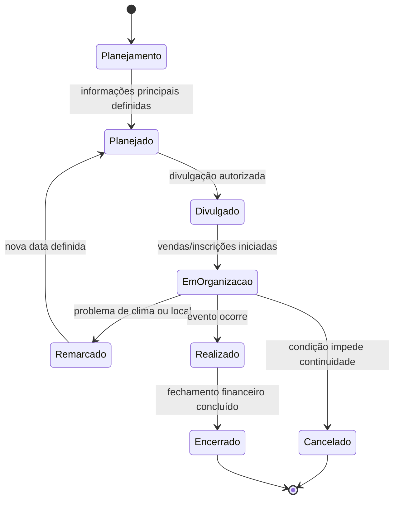
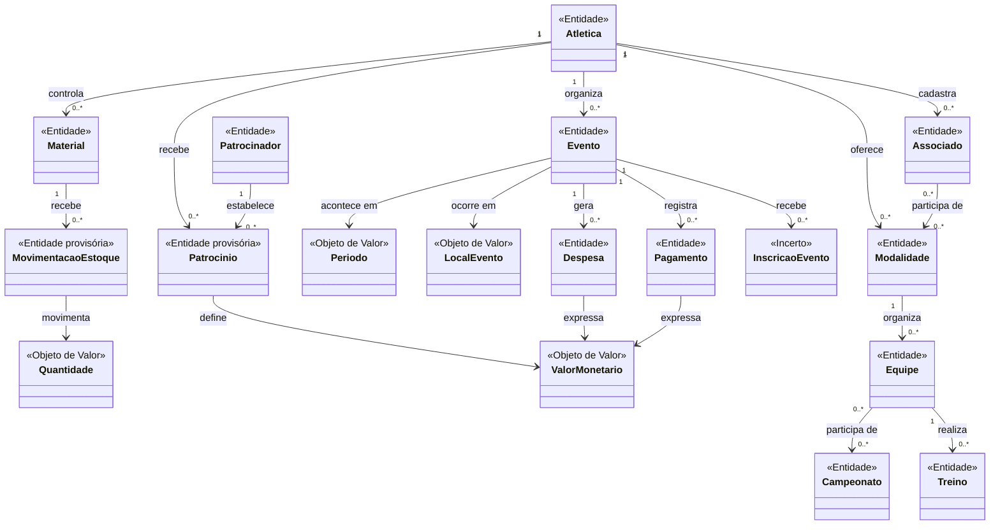

# Da Informação ao Domínio: Modelo Conceitual do Sistema de Gestão de Atlética Universitária

**Disciplina:** Desenvolvimento de Sistemas Corporativos  
**Professor:** Everton Coimbra de Araujo  

**Integrantes:**  
- Adriel Ostrovski
- Bolivar Torres Neto
- Luna Ribeiro

**Tema:** Sistema de Gestão de Atlética Universitária  
**Data:** 22/09/2026

---

# 1. Apresentação e retomada do sistema

O sistema analisado é um **Sistema de Gestão de Atlética Universitária**, criado para apoiar a organização das atividades administrativas e esportivas de uma atlética.

O problema central identificado anteriormente está relacionado à desorganização das informações e das responsabilidades. Existem informações espalhadas, atividades realizadas de forma pouco padronizada e situações em que pessoas com funções diferentes acabam executando tarefas que não estavam originalmente associadas ao seu papel.

O sistema possui escopo amplo e contempla associados e atletas, modalidades esportivas, equipes, treinos, eventos, campeonatos, movimentações financeiras, patrocínios, materiais esportivos e uniformes.

Entre os processos já analisados, o fluxo mais detalhado foi a **organização de um evento da atlética, desde o planejamento inicial até o fechamento financeiro**. Nesse fluxo, a diretoria decide realizar o evento, define suas informações principais, realiza a divulgação, inicia vendas ou inscrições, acompanha a organização, realiza uma revisão geral, executa o evento e posteriormente realiza o fechamento financeiro.

As principais operações identificadas nesse fluxo foram:

- criar e planejar o evento;
- definir data, local, orçamento e responsáveis;
- divulgar o evento;
- controlar vendas ou inscrições;
- registrar despesas e pagamentos;
- acompanhar tarefas;
- remarcar ou cancelar o evento;
- realizar o fechamento financeiro.

As informações que precisam ser conhecidas ou preservadas incluem dados do evento, data, local, responsáveis, orçamento, inscrições ou vendas, participantes, pagamentos, despesas, receitas, patrocínios, resultado financeiro e histórico de alterações.

Esta etapa não inicia uma análise independente. O objetivo é transformar o conhecimento já construído em uma primeira representação conceitual do domínio, mantendo explícitas as dúvidas e hipóteses que ainda precisam de validação.

---

# 2. Rastreabilidade do conhecimento anterior

A modelagem abaixo parte de elementos já identificados nas análises anteriores.

| Elemento anterior | Descrição resumida | Como influencia a modelagem atual |
|---|---|---|
| Problema | Informações espalhadas e responsabilidades pouco claras | Indica que conceitos relacionados a pessoas, funções, atividades e registros precisam ter significado claro no domínio |
| Ator | Associado / atleta | Leva à investigação sobre identidade da pessoa e sobre o papel de atleta dentro da atlética |
| Ator | Diretoria | Mostra a existência de responsabilidades organizacionais, mas a forma conceitual dessas funções ainda precisa ser investigada |
| Módulo | Gestão de Associados | Sugere conceitos como Associado e vínculo com atividades esportivas |
| Módulo | Modalidades | Sugere conceitos como Modalidade e Equipe |
| Módulo | Eventos e Campeonatos | Origina conceitos como Evento, Campeonato, Inscrição e estados do evento |
| Módulo | Financeiro | Origina conceitos como Pagamento, Despesa, Valor Monetário e resultado financeiro |
| Módulo | Patrocínios | Origina os conceitos Patrocinador e Patrocínio |
| Módulo | Estoque | Origina Material e Movimentação de Estoque |
| Fluxo | Organização de evento do início ao fechamento financeiro | É a principal fonte para relações, regras, estados e ciclo de vida de Evento |
| Operação | Controlar vendas/inscrições | Origina a investigação sobre Inscrição em Evento, participante e pagamento |
| Operação | Fechamento financeiro | Sustenta Pagamento, Despesa, receitas e regras relacionadas ao encerramento do evento |
| Hipótese | Um associado pode participar de mais de uma modalidade | Impede confirmar prematuramente a cardinalidade Associado–Modalidade |
| Questão em aberto | Quem pode visualizar ou alterar informações financeiras? | Mostra que funções e permissões ainda não devem ser fechadas conceitualmente |
| Decisão | Não antecipar tecnologia | Mantém o modelo concentrado no domínio e não em banco de dados ou implementação |

---

# 3. Candidatos a conceitos do domínio

A partir dos fluxos, operações, informações, módulos, fatos e questões anteriores, foram selecionados os seguintes candidatos.

| Conceito candidato | De onde surgiu? | Por que parece relevante? | Grau de certeza |
|---|---|---|---|
| Atlética | Escopo geral do sistema | Representa a organização cujas atividades são administradas | Certeza |
| Associado | Atores e Gestão de Associados | A pessoa precisa continuar reconhecível ao longo do tempo | Certeza |
| Modalidade | Gestão esportiva | Representa uma atividade esportiva oferecida pela atlética | Certeza |
| Equipe | Modalidades e campeonatos | Agrupa participantes de uma modalidade em contexto esportivo | Hipótese |
| Treino | Escopo esportivo | Representa uma ocorrência relevante da atividade esportiva | Hipótese |
| Evento | Fluxo principal | É o elemento central do fluxo analisado e possui ciclo de vida próprio | Certeza |
| Campeonato | Escopo e módulo de eventos/campeonatos | Representa uma competição específica | Certeza |
| Inscrição em Evento | Fluxo de vendas/inscrições | Registra a participação ou compra relacionada ao evento | Hipótese |
| Pagamento | Fluxo e financeiro | Precisa ser preservado para acompanhamento e fechamento financeiro | Certeza |
| Despesa | Fluxo e financeiro | Representa um gasto que interfere no resultado do evento | Certeza |
| Patrocinador | Módulo de patrocínios | Representa empresa ou organização parceira | Certeza |
| Patrocínio | Módulo de patrocínios | Representa o acordo ou relação de patrocínio, diferente do patrocinador | Hipótese |
| Material | Estoque | Representa itens esportivos e uniformes controlados pela atlética | Certeza |
| Movimentação de Estoque | Estoque | Representa entrada ou retirada de material ao longo do tempo | Hipótese |
| Papel/Função Organizacional | Problema de responsabilidades | Pode representar responsabilidades como diretoria e financeiro, mas ainda não está claro como deve ser modelado | Dúvida |

Nenhum desses candidatos é considerado Entidade apenas por aparecer como substantivo. As próximas etapas investigam sua natureza.

---

# 4. Investigação de identidade

Para cada conceito principal foi investigado se existe necessidade de identidade própria.

| Conceito | Identidade parece relevante? | Evidência / justificativa | Classificação atual |
|---|---|---|---|
| Atlética | Sim | A organização precisa permanecer reconhecível mesmo que suas informações mudem | Provável Entidade |
| Associado | Sim | A mesma pessoa continua sendo o mesmo associado mesmo com mudança de dados, modalidade ou situação | Provável Entidade |
| Modalidade | Sim | A modalidade continua sendo reconhecida mesmo que atletas, técnicos ou equipes mudem | Provável Entidade |
| Equipe | Sim | A composição pode mudar e a equipe continuar representando o mesmo grupo esportivo | Provável Entidade |
| Treino | Sim | Duas ocorrências podem ter os mesmos dados básicos e ainda representar treinos diferentes | Provável Entidade |
| Evento | Sim | O mesmo evento passa por estados diferentes sem deixar de ser o mesmo evento | Provável Entidade |
| Campeonato | Sim | A competição precisa ser distinguida de outras mesmo quando possui características semelhantes | Provável Entidade |
| Inscrição em Evento | Não sabemos | É necessário confirmar se inscrição e venda são a mesma coisa e se o registro precisa de identidade própria | Incerto |
| Pagamento | Sim | Dois pagamentos do mesmo valor continuam representando ocorrências diferentes | Provável Entidade |
| Despesa | Sim | Gastos iguais podem ocorrer em momentos diferentes e precisam ser distinguidos | Provável Entidade |
| Patrocinador | Sim | A empresa ou organização continua a mesma mesmo com diferentes acordos | Provável Entidade |
| Patrocínio | Sim, provisoriamente | Um mesmo patrocinador pode estabelecer acordos distintos ao longo do tempo | Provável Entidade |
| Material | Sim | Um tipo de material pode ser reconhecido ao longo do tempo mesmo com mudança de quantidade | Provável Entidade |
| Movimentação de Estoque | Sim, provisoriamente | Cada entrada ou retirada precisa ser distinguida no histórico | Provável Entidade |
| Papel/Função Organizacional | Não sabemos | Ainda não está claro se é conceito com identidade, classificação, papel temporário ou apenas regra de responsabilidade | Incerto |

---

# 5. Entidades, Objetos de Valor e outros conceitos

Com base na investigação de identidade, a classificação atual é a seguinte.

| Conceito | Classificação atual | Justificativa | Evidência | Grau de certeza |
|---|---|---|---|---|
| Atlética | Entidade | Possui identidade organizacional própria | Escopo do sistema | Alto |
| Associado | Entidade | Precisa ser reconhecido ao longo do tempo | Gestão de associados | Alto |
| Modalidade | Entidade | Mantém significado mesmo com mudanças de participantes | Escopo esportivo | Alto |
| Equipe | Entidade | Pode mudar de composição sem deixar de ser a mesma equipe | Análise esportiva | Médio |
| Treino | Entidade | Cada ocorrência representa um acontecimento específico | Escopo esportivo | Médio |
| Evento | Entidade | Possui identidade e ciclo de vida claro | Fluxo principal | Alto |
| Campeonato | Entidade | Representa competição específica | Escopo do sistema | Alto |
| Inscrição em Evento | Incerto | Pode representar registro de participação ou de venda; ainda exige investigação | Fluxo de vendas/inscrições | Baixo |
| Pagamento | Entidade | Ocorrências precisam ser preservadas individualmente | Fluxo financeiro | Alto |
| Despesa | Entidade | Cada gasto precisa ser distinguido no histórico | Fechamento financeiro | Alto |
| Patrocinador | Entidade | Representa empresa ou organização identificável | Módulo de patrocínios | Alto |
| Patrocínio | Entidade provisória | Representa um acordo distinto do patrocinador | Análise conceitual | Médio |
| Material | Entidade | Representa item ou tipo de item controlado pela atlética | Estoque | Alto |
| Movimentação de Estoque | Entidade provisória | Registra cada entrada ou retirada | Estoque | Médio |
| Valor Monetário | Objeto de Valor | O significado está no valor e não em identidade própria | Financeiro | Alto |
| Período | Objeto de Valor | O significado está nas datas que formam o intervalo | Eventos, campeonatos e patrocínios | Médio |
| Local do Evento | Objeto de Valor | Importa pela informação de localização associada ao evento | Fluxo do evento | Médio |
| Estado do Evento | Outro conceito / estado | Representa condição atual do ciclo de vida do Evento | Fluxo principal | Alto |
| Quantidade | Objeto de Valor | O significado está no valor numérico usado no estoque | Estoque | Médio |
| Papel/Função Organizacional | Incerto | Ainda faltam evidências para decidir sua natureza | Questão em aberto | Baixo |

---

# 6. Casos de classificação ambígua

## 6.1 Associado e Atleta

**Classificação inicialmente considerada:** Associado e Atleta como Entidades diferentes.

**Dúvida encontrada:** ambos poderiam representar a mesma pessoa em contextos diferentes.

**Alternativas analisadas:**

- tratar Associado e Atleta como Entidades distintas;
- tratar Atleta como um papel assumido por um Associado quando participa de uma modalidade.

**Evidência disponível:** o sistema já precisa reconhecer o Associado como pessoa ao longo do tempo. Até o momento não existe evidência suficiente de que Atleta precise possuir identidade independente dessa pessoa.

**Classificação atual:** Associado permanece como Entidade e Atleta é tratado provisoriamente como papel.

**Grau de certeza:** médio.

**O que poderia mudar a decisão:** descobrir que existem atletas que não são associados, ou que o domínio reconhece formalmente identidades diferentes para associado e atleta.

## 6.2 Inscrição em Evento e Venda de Ingresso

**Classificação inicialmente considerada:** uma única Entidade chamada Inscrição em Evento.

**Dúvida encontrada:** o fluxo anterior usou tanto “venda” quanto “inscrição”, mas não foi confirmado se esses termos representam o mesmo comportamento.

**Alternativas analisadas:**

- utilizar um único conceito;
- separar Venda de Ingresso e Inscrição em Evento;
- tratar uma delas apenas como uma operação e não como Entidade.

**Evidência disponível:** sabemos que após a divulgação começam vendas ou inscrições e que existem dados do participante e pagamento, mas ainda não sabemos se todo evento utiliza o mesmo mecanismo.

**Classificação atual:** conceito incerto, mantido provisoriamente como Inscrição em Evento.

**Grau de certeza:** baixo.

**O que poderia mudar a decisão:** analisar eventos reais e identificar se existem eventos gratuitos, eventos apenas com inscrição ou eventos com venda de ingressos.

## 6.3 Patrocinador e Patrocínio

**Classificação inicialmente considerada:** ambos como Entidades.

**Dúvida encontrada:** seria possível considerar apenas o Patrocinador e tratar os dados do acordo como valores associados.

**Alternativas analisadas:**

- manter somente Patrocinador;
- separar Patrocinador da relação Patrocínio.

**Evidência disponível:** um mesmo patrocinador pode estabelecer relações em períodos diferentes e com valores diferentes.

**Classificação atual:** Patrocinador e Patrocínio permanecem separados, porém Patrocínio continua provisório.

**Grau de certeza:** médio.

---

# 7. Relações entre conceitos

As relações são descritas com verbos que expressem significado no domínio.

| Conceito A | Relação | Conceito B | Significado no domínio | Evidência |
|---|---|---|---|---|
| Atlética | cadastra | Associado | A organização mantém o vínculo dos seus associados | Gestão de associados definida no escopo |
| Atlética | oferece | Modalidade | As modalidades fazem parte das atividades esportivas da atlética | Escopo esportivo |
| Associado | participa de | Modalidade | O associado pode atuar em uma modalidade esportiva | Escopo do sistema; cardinalidade ainda não confirmada |
| Modalidade | organiza | Equipe | Equipes são formadas dentro de uma modalidade | Hipótese baseada no escopo esportivo |
| Equipe | realiza | Treino | Os treinos representam ocorrências de atividade esportiva de uma equipe | Hipótese baseada no escopo esportivo; fluxo de treinos ainda não foi aprofundado |
| Equipe | participa de | Campeonato | Equipes podem representar a atlética em competições | Escopo de campeonatos |
| Atlética | organiza | Evento | A organização de eventos é uma atividade da atlética | Fluxo principal analisado |
| Evento | recebe | Inscrição em Evento | Participações ou vendas são registradas em relação ao evento | Fluxo de vendas/inscrições |
| Evento | gera | Despesa | A organização e realização produzem gastos | Fechamento financeiro |
| Evento | registra | Pagamento | Pagamentos relacionados ao evento precisam ser preservados | Fluxo financeiro |
| Patrocinador | estabelece | Patrocínio | O patrocinador firma uma relação de patrocínio | Módulo de patrocínios; natureza exata da relação ainda precisa ser validada |
| Atlética | recebe | Patrocínio | O patrocínio representa uma relação de apoio destinada à atlética ou a alguma de suas atividades | Hipótese; ainda não está claro se todo patrocínio se relaciona à atlética como um todo, a um evento específico ou aos dois |
| Atlética | controla | Material | Materiais e uniformes fazem parte do patrimônio controlado | Módulo de estoque |
| Material | recebe | Movimentação de Estoque | Entradas e retiradas alteram a situação do material | Módulo de estoque |

---

# 8. Cardinalidades

As cardinalidades abaixo representam o conhecimento atual. Quando não há evidência suficiente, a incerteza é mantida explicitamente.

| Relação | Cardinalidade atual | Evidência | Grau de certeza |
|---|---|---|---|
| Atlética cadastra Associado | 1 : 0..* | O sistema foi pensado inicialmente para uma única atlética com vários associados | Hipótese de modelagem |
| Atlética oferece Modalidade | 1 : 0..* | O escopo prevê várias modalidades | Hipótese de modelagem |
| Associado participa de Modalidade | N : N | Parece possível um associado participar de várias modalidades e cada modalidade ter vários associados | Hipótese; precisa validação |
| Modalidade organiza Equipe | 1 : 0..* | Faz sentido no escopo esportivo, mas não foi aprofundado | Hipótese |
| Equipe realiza Treino | 1 : 0..* | O sistema contempla treinos, mas esse fluxo ainda não foi analisado em profundidade | Hipótese |
| Equipe participa de Campeonato | N : N | Uma equipe pode disputar campeonatos diferentes e campeonatos podem reunir várias equipes | Hipótese |
| Atlética organiza Evento | 1 : 0..* | A atlética organiza diferentes eventos | Confirmada para o contexto atual; múltiplas atléticas por evento não foram investigadas |
| Evento recebe Inscrição em Evento | 1 : 0..* | O fluxo prevê vendas ou inscrições após a divulgação | Confirmada quanto à multiplicidade do Evento; natureza da inscrição ainda é hipótese |
| Evento gera Despesa | 1 : 0..* | O fechamento financeiro considera despesas do evento | Confirmada no fluxo analisado |
| Evento registra Pagamento | 1 : 0..* | O fluxo prevê pagamentos relacionados às vendas e ao evento | Confirmada no fluxo analisado |
| Patrocinador estabelece Patrocínio | 1 : 0..* | Pode haver relações em momentos diferentes, mas isso ainda precisa ser validado | Hipótese |
| Atlética recebe Patrocínio | 1 : 0..* | O sistema contempla patrocínios, mas ainda não está claro se um patrocínio se vincula à atlética, a um evento específico ou aos dois | Hipótese / questão em aberto |
| Atlética controla Material | 1 : 0..* | O escopo prevê controle de materiais esportivos e uniformes | Hipótese de modelagem |
| Material recebe Movimentação de Estoque | 1 : 0..* | Entradas e retiradas podem ocorrer repetidamente | Hipótese |

A principal cardinalidade ainda sem segurança é **Associado–Modalidade**. Não há evidência suficiente para afirmar definitivamente que a relação é muitos-para-muitos.

---

# 9. Regras de Negócio

As regras abaixo foram extraídas de decisões, condições, impedimentos e mudanças de estado já identificadas.

| ID | Regra de Negócio | Conceitos envolvidos | Origem / evidência | Situação |
|---|---|---|---|---|
| RN01 | Um evento só pode ser divulgado quando data, local, orçamento, responsáveis e atrações ou atividades estiverem definidos | Evento | Fluxo principal e planejamento do evento | Confirmada no fluxo analisado |
| RN02 | Uma venda ou inscrição só pode ser confirmada quando os dados necessários estiverem corretos e o pagamento obrigatório tiver sido realizado | Inscrição em Evento, Pagamento | Operação de controle de vendas/inscrições | Confirmada no fluxo analisado |
| RN03 | Um evento pode ser remarcado quando problemas com clima ou local impedirem sua realização na data prevista | Evento, Local do Evento | Variação de negócio identificada | Confirmada no fluxo analisado |
| RN04 | O fechamento financeiro deve considerar vendas, receitas, despesas, pagamentos e patrocínios ou outras entradas relacionadas ao evento | Evento, Pagamento, Despesa, Patrocínio | Operação de fechamento financeiro | Confirmada parcialmente |
| RN05 | Despesas não registradas, pagamentos pendentes ou informações financeiras incompletas podem impedir a conclusão confiável do fechamento financeiro | Evento, Pagamento, Despesa | Impedimentos identificados no fluxo | Confirmada parcialmente |
| RN06 | Um evento pode ser cancelado quando falta de orçamento, problema grave de local, vendas insuficientes ou cancelamento de fornecedor/atração impedirem sua continuidade | Evento | Situações de falha identificadas | Hipótese quanto ao critério exato de cancelamento |

Não foram criadas regras adicionais apenas para aumentar a quantidade. As regras acima correspondem ao conhecimento efetivamente levantado.

---

# 10. Invariantes e proteção da consistência

Nem toda Regra de Negócio precisa ser uma invariante. Foram selecionadas apenas condições que parecem precisar permanecer verdadeiras para que determinado conceito continue válido.

| Conceito protegido | Possível invariante | O que poderia violá-la? | Consequência | Evidência |
|---|---|---|---|---|
| Evento | Se o Evento estiver Divulgado, suas informações principais de planejamento precisam estar definidas | Divulgar sem data, local, orçamento, responsáveis ou atrações/atividades definidos | Evento divulgado em estado incoerente com o fluxo | RN01 |
| Inscrição em Evento | Uma inscrição confirmada deve satisfazer as condições necessárias de dados e pagamento | Confirmar com dados incorretos ou sem pagamento obrigatório | Participação registrada de forma inválida | RN02 |
| Pagamento / Despesa | Um registro financeiro precisa possuir um Valor Monetário válido | Registrar ocorrência financeira sem valor | Impossibilidade de apurar corretamente o resultado | Natureza do financeiro |
| Movimentação de Estoque | Uma movimentação precisa estar relacionada a um Material | Registrar entrada ou retirada sem identificar o material | Histórico de estoque sem significado | Natureza da movimentação |

As duas primeiras invariantes possuem sustentação direta no fluxo de eventos analisado. As invariantes relacionadas a registros financeiros e estoque são **possíveis invariantes ainda sujeitas a validação**, pois esses processos não foram investigados com o mesmo nível de detalhe do fluxo de eventos.

---

# 11. Estados e ciclo de vida

Evento é a Entidade que atualmente possui o ciclo de vida mais bem sustentado.

**Planejamento:** o evento já foi proposto, mas suas informações principais ainda estão sendo definidas.

**Planejado:** as informações mínimas consideradas no fluxo já foram definidas.

**Divulgado:** o evento já foi anunciado e pode avançar para vendas ou inscrições.

**Em Organização:** vendas, tarefas, pagamentos e contratações estão sendo acompanhados.

**Remarcado:** uma condição como clima ou local exigiu alteração da data.

**Cancelado:** alguma condição impediu a continuidade do evento.

**Realizado:** o evento ocorreu, mas ainda não foi encerrado financeiramente.

**Encerrado:** o fechamento financeiro foi concluído.

A transição **Realizado → Encerrado** ainda possui uma incerteza: a regra exata que determina quando o fechamento financeiro está oficialmente concluído continua em aberto.

---

# 12. Primeiro Modelo Conceitual do Sistema

O modelo abaixo representa o conhecimento atual. Ele não é um diagrama de banco de dados e não representa decisões técnicas de persistência.

As cardinalidades apresentadas como hipóteses continuam sujeitas a revisão. O objetivo do modelo é mostrar como o sistema parece estar organizado diante do conhecimento que a equipe consegue justificar neste momento.

---

# 13. Explicação do Modelo Conceitual

Os conceitos principais aparecem no modelo porque correspondem a elementos já identificados nos processos da atlética.

**Associado** foi tratado como Entidade porque representa uma pessoa que precisa permanecer reconhecível ao longo do tempo. **Atleta** não aparece como Entidade separada, pois ainda não existe evidência suficiente de que possua identidade diferente da pessoa associada.

**Evento** possui a sustentação mais forte do modelo, porque foi o conceito central do fluxo analisado. Ele possui identidade, relações com inscrições, pagamentos e despesas, além de ciclo de vida claro.

**Modalidade, Equipe, Treino e Campeonato** representam o lado esportivo do sistema. Entretanto, como esses fluxos ainda não foram analisados em profundidade, algumas relações e cardinalidades permanecem como hipóteses.

**Pagamento** e **Despesa** são Entidades porque ocorrências diferentes precisam ser preservadas individualmente. O **Valor Monetário** foi tratado como Objeto de Valor porque seu significado está no valor representado, e não em uma identidade própria.

**Patrocinador** e **Patrocínio** foram separados porque a organização patrocinadora é diferente do acordo firmado. Essa separação ainda é provisória e deverá ser confirmada com casos reais.

**Material** e **Movimentação de Estoque** aparecem porque o sistema deve controlar materiais esportivos e uniformes. A necessidade de identificar materiais individualmente ou apenas por quantidade continua em aberto.

A principal incerteza de classificação é **Inscrição em Evento**, pois ainda não está claro se venda de ingresso e inscrição representam o mesmo conceito.

Quanto às **cardinalidades**, as relações ligadas diretamente ao fluxo de eventos possuem maior sustentação, especialmente **Evento gera Despesa** e **Evento registra Pagamento**. A relação **Atlética organiza Evento** é considerada confirmada para o contexto atual, embora a possibilidade de eventos organizados por mais de uma atlética ainda não tenha sido investigada. Já **Associado participa de Modalidade**, **Modalidade organiza Equipe**, **Equipe realiza Treino**, **Equipe participa de Campeonato**, **Patrocinador estabelece Patrocínio**, **Atlética recebe Patrocínio** e as relações de estoque permanecem como hipóteses ou pontos que exigem validação.

As **Regras de Negócio RN01, RN02 e RN03** influenciam diretamente o modelo e o ciclo de vida do Evento, pois condicionam a divulgação, a confirmação de vendas ou inscrições e a remarcação. As regras de fechamento financeiro e cancelamento também são relevantes, porém ainda possuem partes não totalmente confirmadas.

Os elementos que permanecem com maior incerteza são **Inscrição em Evento**, **Papel/Função Organizacional**, a relação entre **Associado e Atleta**, algumas cardinalidades do lado esportivo, a natureza do **Patrocínio** e a regra exata para considerar o fechamento financeiro concluído.

---

# 14. Evolução do modelo

O modelo não surgiu pronto. Ele foi sendo refinado conforme os conceitos eram questionados.

| Momento | Alteração realizada | Motivo | Evidência ou descoberta que provocou a mudança |
|---|---|---|---|
| Identificação inicial | Listagem dos principais substantivos do sistema | Levantar candidatos | Escopo e módulos definidos anteriormente |
| Investigação de identidade | Atleta deixou de ser tratado automaticamente como Entidade separada | Pode representar apenas um papel do Associado | Ausência de evidência de identidade independente |
| Classificação | Valor Monetário, Período e Local foram tratados como Objetos de Valor | Importam principalmente pelos valores que carregam | Análise de identidade |
| Relações | Relações passaram a usar verbos como organiza, participa, gera, registra e estabelece | Dar significado de domínio às conexões | Atividades realizadas em aula e análise do fluxo |
| Cardinalidades | Algumas cardinalidades passaram a ser marcadas como hipótese | Não havia evidência suficiente para tratá-las como certeza | Revisão crítica da modelagem |
| Regras | Regras foram extraídas do fluxo de eventos | Evitar criar regras por intuição | Decisões, impedimentos e mudanças de estado já identificados |
| Modelo atual | Inscrição em Evento e Papel/Função continuam incertos | Conhecimento ainda insuficiente | Questões em aberto mantidas explicitamente |

---

# 15. Revisões identificadas em relação aos documentos anteriores

Esta etapa exige registrar mudanças relevantes no conhecimento anterior, mesmo que os documentos antigos não sejam reenviados agora.

| Documento ou conhecimento anterior | Revisão identificada | Motivo | Impacto futuro |
|---|---|---|---|
| Trabalho 1 — atores | Atleta e Associado não devem ser considerados automaticamente conceitos independentes | Pode existir uma única identidade de pessoa com papéis diferentes | Rever linguagem de atores e responsabilidades quando o domínio for aprofundado |
| Trabalho 1 — módulos | O módulo Financeiro continua relevante, mas parte de suas regras está diretamente ligada ao ciclo do Evento | O fechamento financeiro depende de estados e registros do evento | Rever fronteiras e responsabilidades arquiteturais no trabalho posterior |
| Trabalho 1 — Eventos e Campeonatos | Evento e Campeonato passam a ser reconhecidos como conceitos diferentes | Possuem significados e ciclos distintos | Evitar agrupar comportamentos diferentes apenas por conveniência funcional |
| Trabalho 1 — atores e permissões | Responsabilidades de diretoria, tesouraria e responsáveis esportivos continuam insuficientemente definidas | O problema original já apontava sobreposição de funções | Manter como pendência antes de fechar responsabilidades |
| Conhecimento de eventos | Venda e Inscrição não devem ser tratadas automaticamente como o mesmo conceito | O fluxo usava os dois termos sem diferenciação suficiente | Investigar antes de definir modelo definitivo |
| Conhecimento de estoque | Controle apenas por quantidade ainda não pode ser considerado definitivo | Pode haver materiais que precisem de identificação individual | Validar o funcionamento real do estoque |

---

# 16. Pendências de Governança

As seguintes pendências devem permanecer registradas para evitar que dúvidas conceituais sejam esquecidas nas próximas etapas.

| Item a revisar futuramente | Motivo | Prioridade | Consequência se permanecer desatualizado |
|---|---|---|---|
| Relação Associado–Atleta | Ainda não sabemos se são identidades diferentes ou papéis | Alta | Duplicação conceitual ou responsabilidades incorretas |
| Cardinalidade Associado–Modalidade | Não existe evidência suficiente de N:N | Alta | Modelo esportivo pode representar uma regra inexistente |
| Venda de Ingresso x Inscrição em Evento | Os termos foram usados juntos sem diferenciação | Alta | Regras de participação e pagamento podem ficar misturadas |
| Funções organizacionais | Responsabilidades ainda não estão suficientemente definidas | Alta | O sistema pode reproduzir a mesma sobreposição de funções existente hoje |
| Encerramento financeiro | Não há regra exata para determinar quando o fechamento está concluído | Alta | Estado Encerrado pode ser aplicado de forma inconsistente |
| Patrocínio | Não está claro se se relaciona à atlética, a eventos específicos ou aos dois | Média | Relações financeiras e de evento podem ficar incompletas |
| Controle de materiais | Não está claro se todos os itens são controlados somente por quantidade | Média | Modelo de estoque pode precisar ser reformulado |
| Treinos | Fluxo e regras ainda não foram detalhados | Média | Conceito Treino pode estar simplificado demais |

---

# 17. Análise crítica do modelo

**1. Qual parte do modelo possui melhor sustentação?**  
O conceito Evento e seu ciclo de vida, porque derivam diretamente do fluxo analisado em maior profundidade.

**2. Qual conceito possui classificação mais incerta?**  
Inscrição em Evento, porque ainda não está claro se inscrição e venda representam o mesmo conceito ou comportamentos distintos.

**3. Qual relação possui justificativa mais frágil?**  
Modalidade organiza Equipe, pois o escopo esportivo indica essa possibilidade, mas esse processo ainda não foi analisado com profundidade.

**4. Qual cardinalidade ainda precisa de validação?**  
Principalmente Associado participa de Modalidade, atualmente representada como N:N apenas como hipótese.

**5. Qual regra possui maior impacto sobre o modelo?**  
RN01, porque define quando o Evento pode mudar para o estado Divulgado e influencia diretamente seu ciclo de vida.

**6. Existe alguma decisão baseada principalmente em intuição?**  
A separação de Patrocinador e Patrocínio ainda depende parcialmente de interpretação conceitual e precisa de validação com situações reais.

**7. Qual hipótese, se rejeitada, provocaria maior mudança?**  
Se Atleta precisar de identidade própria separada de Associado, parte significativa do modelo esportivo precisará ser revista.

**8. Que nova informação poderia modificar significativamente o modelo?**  
Uma definição formal das responsabilidades dos cargos e dos processos de modalidades, treinos, patrocínios e estoque.

**9. Qual parte provavelmente será revisada futuramente?**  
As cardinalidades e os conceitos que atualmente estão marcados como provisórios ou incertos.

**10. Existe contradição com o trabalho anterior?**  
Não existe uma contradição obrigatória, mas há refinamentos. Conceitos que antes apareciam separados, como Associado e Atleta, agora são questionados com base na investigação de identidade.

---

# 18. Reflexão da equipe

**1. O que foi descoberto sobre o sistema que não estava claro anteriormente?**  
Ficou mais claro que o sistema não pode ser compreendido apenas por módulos ou por uma lista de funcionalidades. Conceitos como Evento, Associado, Pagamento e Patrocínio precisam ser analisados quanto à identidade, relações, regras e ciclo de vida. Também ficou evidente que várias afirmações que pareciam naturais ainda são hipóteses.

**2. Qual conceito foi mais difícil de classificar?**  
**Inscrição em Evento**, porque ainda não sabemos se representa inscrição, venda de ingresso ou se esses comportamentos devem permanecer separados.

**3. Qual relação exigiu maior discussão?**  
**Associado participa de Modalidade**, principalmente por causa da cardinalidade e da dúvida sobre a diferença entre Associado e Atleta.

**4. Alguma informação inicialmente simples passou a ser reconhecida como Entidade?**  
Até o momento, não foi identificado um caso com evidência suficiente para afirmar essa mudança. A equipe preferiu não transformar informações em Entidades sem justificativa de identidade própria.

**5. Algum conceito inicialmente considerado Entidade deixou de parecer necessário?**  
Sim. **Atleta** inicialmente poderia ser tratado como Entidade independente, mas a investigação indicou que ele pode representar apenas um papel assumido pelo Associado quando participa de uma modalidade. Essa decisão continua provisória.

**6. Alguma cardinalidade aparentemente óbvia revelou-se uma hipótese?**  
Sim. A ideia de que um Associado pode participar de várias Modalidades e que cada Modalidade pode reunir vários Associados parecia natural, mas ainda não há evidência suficiente para confirmar a relação N:N.

**7. Qual Regra de Negócio mais influenciou o modelo?**  
A regra de que um Evento só pode ser divulgado depois que suas informações principais estiverem definidas, pois ela define uma transição importante de estado e protege a consistência do fluxo.

**8. Qual decisão anterior precisa ser revisada?**  
Principalmente a forma como atores, módulos e responsabilidades foram interpretados no Trabalho 1. Por exemplo, Associado e Atleta não devem ser tratados automaticamente como conceitos independentes, e Evento e Campeonato precisam ser compreendidos como conceitos diferentes.

**9. O que está evitando uma compreensão completa do sistema?**  
Ainda faltam informações mais detalhadas sobre responsabilidades dos cargos, modalidades, treinos, patrocínios, estoque, a diferença entre venda e inscrição e a condição exata para encerrar financeiramente um evento.

**10. A equipe considera o modelo atual suficientemente fundamentado para sustentar as próximas etapas do projeto? Por quê?**  
Sim, desde que as pendências de governança permaneçam registradas e que conceitos incertos não sejam tratados como decisões definitivas. A parte relacionada ao fluxo de eventos possui boa sustentação, enquanto as demais áreas estão claramente marcadas como hipóteses ou pontos que precisam de validação.

---

# 19. Apêndice — Uso de Inteligência Artificial

## Ferramenta utilizada

Foi utilizado o **ChatGPT** como ferramenta de apoio à investigação e à crítica do modelo conceitual. Na revisão final deste documento foi utilizado o modelo **GPT-5.6 Sol**; nas interações anteriores, o modelo específico não foi registrado pela equipe.

## Finalidade

A ferramenta foi utilizada para:

- organizar informações obtidas nos trabalhos e análises anteriores;
- questionar a classificação dos conceitos;
- investigar necessidade de identidade;
- comparar alternativas de modelagem;
- questionar relações e cardinalidades;
- extrair Regras de Negócio do fluxo já analisado;
- identificar hipóteses e pontos com evidência insuficiente;
- revisar coerência entre o modelo e o conhecimento anterior.

## Contribuições relevantes

A interação ajudou principalmente a evitar que todo substantivo encontrado no domínio fosse automaticamente classificado como Entidade. Também contribuiu para tornar explícitas as dúvidas sobre Associado/Atleta, Inscrição/Venda, Patrocinador/Patrocínio e algumas cardinalidades.

## Hipóteses reveladas

Entre as hipóteses que ficaram mais claras durante a análise estão:

- um associado pode participar de várias modalidades;
- uma modalidade pode organizar várias equipes;
- um patrocinador pode estabelecer vários patrocínios ao longo do tempo;
- materiais podem ser controlados apenas por quantidade;
- inscrição e venda de ingresso podem representar o mesmo conceito.

## Classificações questionadas

Foram questionadas principalmente:

- Atleta como Entidade independente;
- Inscrição em Evento como Entidade definitiva;
- Patrocínio como Entidade já confirmada;
- Papel/Função Organizacional como conceito de natureza já conhecida.

## Sugestões rejeitadas

Não foi adotada a ideia de transformar automaticamente cargos como Tesoureiro, Diretor de Esportes e Técnico em Entidades. As responsabilidades ainda não estão suficientemente definidas para justificar essa decisão conceitual.

Também não foram tratadas todas as cardinalidades como confirmadas apenas porque pareciam intuitivas.

## Avaliação crítica

A Inteligência Artificial ajudou principalmente a organizar perguntas, apontar incertezas e confrontar classificações que pareciam óbvias inicialmente.

Sua principal limitação é não possuir conhecimento próprio sobre o funcionamento real da atlética. Em alguns momentos, a IA apresentou relações, classificações ou cardinalidades conceitualmente plausíveis, mas sem evidência suficiente sobre a realidade específica da organização. Essas respostas poderiam parecer convincentes mesmo sem sustentação no domínio.

A equipe evitou tratar essas sugestões como fatos. Quando faltava evidência, a informação foi mantida como hipótese, dúvida, questão em aberto ou decisão provisória. As sugestões foram verificadas por comparação com o fluxo de eventos já analisado, com as atividades realizadas em aula, com o Trabalho 1 e com as informações fornecidas pela própria equipe. A validação final permanece responsabilidade da equipe.

## Questão final obrigatória

**Se a IA fosse retirada agora, a equipe conseguiria explicar, justificar e defender cada elemento do modelo conceitual produzido?**

Sim. O modelo parte do sistema definido pela equipe, do Trabalho 1 e do fluxo de eventos analisado anteriormente. As classificações com maior sustentação estão ligadas a elementos que já possuem evidência no domínio, enquanto os pontos menos seguros foram explicitamente marcados como hipóteses ou pendências. Dessa forma, a equipe consegue explicar tanto as decisões atuais quanto os motivos pelos quais algumas partes ainda não foram fechadas definitivamente.
